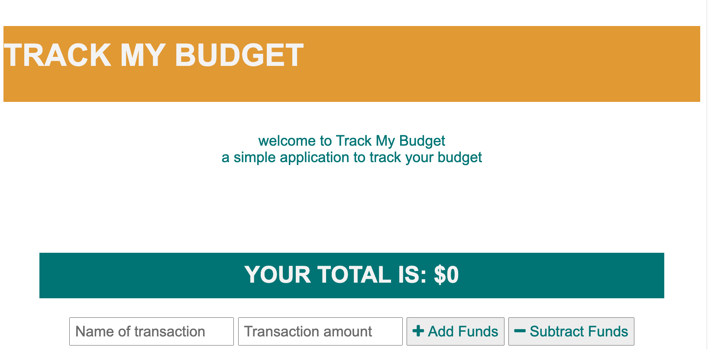

# Track My Budget
This application provides an easy way to track a budget. The user is able to add expenses and deposits to their budget with or without an internet connection. 

## Table of Contents

* [`Technologies`](#technologies)
* [`Screenshot`](#screenshot)
* [`Deployment`](#deployment)
* [`Questions`](#questions)

## Technologies

* IndexedDB
* Service Worker
* NodeJS
* ExpressJS
* JSON
* Heroku
* MongoDB Atlas

## Screenshot

## Deployment

[Heroku](https://limitless-sierra-65574.herokuapp.com)

## Questions
[Github](https://github.com/sidoniag)

[Email](seekersig@gmail.com)